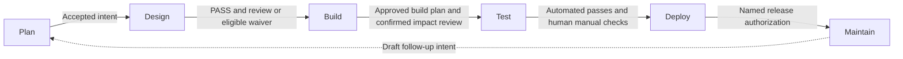

# Toque Methodology

Preparation is cheaper than fixing a release during dinner rush. This reference
explains why Toque asks for explicit intent, independent checks, and a recorded
human production decision. The kitchen is an analogy; the contracts below use
their technical names.

<p align="center">
  
</p>

For current operation, start with the [workflow](documentation/the-plan-workflow.md),
[design gate and its limits](documentation/the-design-gate.md), or
[plugin guide](plugins/toque/GUIDE.md). This is a methodological reference, not
a command reference: active behavior and historical context are labelled separately. Its reference version
below is not the installed plugin version. Current stage instructions and gate
scripts govern behavior; the formal section numbering and canonical lint rule text are retained.

## The Engineering Methods Behind the Grade

Version 11.0.0 (historical reference version) | Conformance review: September 4, 2026.

The installed package version is **11.0.1**, from [plugins/toque/.claude-plugin/plugin.json](plugins/toque/.claude-plugin/plugin.json).
[.claude-plugin/marketplace.json](.claude-plugin/marketplace.json) pins `plugins/toque` to `v11.0.1`, commit
`63a05063ed87b2a9168127ca715208c4cad74d5a`. This review compared that package with
the current checkout; local prose changes do not create a new published release.

> **Scope note (11.0.0).** Sections 1, 2, 4 and 9 retain the history of the
> removed codebase-analysis product. They describe no currently shipped scanner,
> grade, governance generator, or monitoring service. Section 9 also documents
> active plan-linked troubleshooting below its historical assessment material.
> Sections 5, 6, 8, 10 and 11 contain active methods and labelled history.
>
> **Section numbers and existing headings remain stable.** Specs and plan records
> cite them; `tests/layer1-repo.sh` derives section 7's bounds from headings 7 and 8.

**Reading the evidence.** “The workflow requires” means an instruction in a command,
skill, agent, or template. “The validator enforces” describes executable checks
when that validator runs. Neither establishes that an agent obeyed every instruction.
Repository tests verify their stated fixtures and wiring, not production safety.
External sources establish foundations or credit origins, not Toque implementation
or effectiveness. Original thresholds and controls below are Toque design choices.

The [conformance audit](docs/plans/2026-09-04-methodology-conformance/manifest.md)
records claim-level findings, source checks, verification gaps, and unresolved
implementation conflicts. It is a repository record, not part of the plugin.

## 1. The Report Card Model

**Historical section.** The codebase-analysis capabilities below were removed in 11.0.0.

### Why Grades Beat Checklists

**Retired in 11.0.0.** Earlier versions used letter grades to summarize a codebase
assessment. This was a presentation choice, not evidence that a letter predicts
safe autonomous development. Current plan audits use per-criterion verdicts.
The prior reference credited Matt Pocock and Mark Mishaev as inspirations; the
source audit preserves those credits without treating their work as validation
of Toque's grading thresholds.

### The Grading Scale

**Historical definition, not a current gate.** The recorded percentage bands were:

```text
A+ 97-100  A 93-96  A- 90-92  B+ 87-89  B 83-86  B- 80-82
C+ 77-79   C 73-76  C- 70-72  D+ 67-69  D 63-66  F 0-62
```
These are Toque's former bands, not a universal academic or industry standard.

#### Read the Grade in Four Bands

**Historical.** A, B, C, and D/F were presentation groupings. None authorizes agent autonomy in the current plugin.

### What Each Grade Means in Practice

**Historical.** The former B- (80%) readiness threshold was a product heuristic. Claims that lower grades make AI unproductive, or that A+ permits unattended work, have no demonstrated calibration here and are withdrawn. No current command computes these grades.

## 2. The Three Grade Categories

**Historical section.** The codebase-analysis capabilities below were removed in 11.0.0.

### Past, Present, Future

**Retired assessment model.** The three categories organized documentation, risk and delivery, and operational readiness. Their dependency order was an earlier product workflow, not a prerequisite enforced by current Toque.

### Category 1: Documentation as the Foundation (Past)

**Retired.** Earlier scanners described features, dependencies, and business rules. Current planning reads relevant source directly and may consume existing external reports; it does not generate the former codebase inventory. The unsupported “67% of legacy systems” statistic is not retained.

### Category 2: Phased Delivery Over Big-Bang Releases (Present)

**Retired assessment definitions.** The earlier heuristic was business criticality
× dependency exposure, with fan-in >20 and fan-out >40 flags, and CRITICAL,
MANAGED, and DEFERRED debt buckets. These were not validated universal thresholds.
Current plans still specify delivery phases and risks, but do not execute that
codebase-wide classifier.

### Category 3: Operational Readiness (Future)

**Retired.** Guardrail coverage, context currency, test safety nets, and change
readiness were the four assessment areas. [Google SRE: The Evolving SRE Engagement Model](https://sre.google/sre-book/evolving-sre-engagement-model/) supplies a foundational
example of operational acceptance criteria, not a certification of Toque's
former categories or a universal readiness standard.

### Sources for the Three-Category Framework

[Google SRE: The Evolving SRE Engagement Model](https://sre.google/sre-book/evolving-sre-engagement-model/) discusses SRE engagement and production readiness review.
[Ryan Lopopolo, OpenAI: Harness engineering](https://openai.com/index/harness-engineering/) describes OpenAI's engineering experience with repository
knowledge and mechanical constraints. Neither defines Toque's three-category
taxonomy. The previous Cortex homepage citation did not substantiate the named
tiers; the GitLab readiness page is now labelled deprecated. Their audit records
remain in the source audit, not as current authorities here.

## 3. The Six-Stage Planning Method

The kitchen analogy is an operating manual for these stages: the ticket rail
captures intent, the prep list specifies the work, the brigade builds it, the
temperature probe checks it, the expeditor prepares the authorized handoff,
and dish pit feedback starts the next ticket. See the
[stage-by-stage walkthrough](documentation/the-plan-workflow.md) for how the
analogy maps to artifacts and human gates.

### Relationship to the AI-Native SDLC playbook

[Louis Claxton, Anthropic: The AI-Native SDLC playbook](https://claude.com/blog/the-ai-native-sdlc-playbook) (August 21, 2026) is the lifecycle reference: planning, design,
build, test, deploy, and maintain connected by versioned artifacts with human
accountability. The plays are modular, not a specification for this plugin.

Toque adapts that model through its [plan skill](plugins/toque/skills/plan/SKILL.md) and
six stage files. Its named acceptance, binary Design gate, canary, evidence
validator, solo waiver, and prohibition on agent-run production release are
Toque choices. Installing it does not supply the playbook's automatic handoffs,
CI/CD platform, continuous evaluations, or live production monitoring.
Maintain consumes incident records during the workflow.

The three registered hooks are informational. Structural repository tests are
not a calibrated end-to-end evaluation of agent accuracy. See
[gate limits](documentation/the-design-gate.md#what-this-does-not-prove).

### Design Before Code

The workflow requires accepted intent before a specification, an approved
specification before Build, and approved `plan.md` before implementation.
[Louis Claxton, Anthropic: The AI-Native SDLC playbook](https://claude.com/blog/the-ai-native-sdlc-playbook) supplies the artifact-chain foundation; Toque's extra gates and
approval records are its adaptation. Commits and approvals are workflow
instructions, not automatic Git or identity enforcement.

**Implementation:** [plugins/toque/skills/plan/SKILL.md](plugins/toque/skills/plan/SKILL.md) (lifecycle, approval_tiers, workflow). **Verification:** [tests/layer1-core.sh](tests/layer1-core.sh); structural checks do not establish agent compliance.

### The Six Stages at a Glance


The arrows describe required workflow decisions, not an executable state machine.

#### What Each Stage Commits

| Stage | Required records | Decision |
| --- | --- | --- |
| Plan | intent.md and research | Named owner accepts intent |
| Design | spec.md, audit.md, evidence/ | PASS plus recorded review or eligible waiver |
| Build | plan.md, authorized code, applicable CRs, impact-review.md | Build plan approved before code; impact review confirmed |
| Test | test-plan.md and recorded results | Automated passes; manual checks confirmed |
| Deploy | review.md and departures from plan | Named human authorizes release |
| Maintain | Linked incident records, bookkeeping, draft follow-up intent when triggered | Follow-up returns for acceptance; no completion gate |

These are records the [workflow](plugins/toque/skills/plan/SKILL.md) calls for, not a promise
that every stage creates exactly one commit. Some stage files update state without
an explicit commit instruction. Authorization alone is not evidence of deployment.

#### Read the Six Stages in Three Movements

Frame (Plan/Design), Deliver (Build/Test), and Release and Learn (Deploy/Maintain) are explanatory groupings. They introduce no additional runtime stage or permission.

### Stage 1: Plan

The workflow requires an interview before research: one plain-language question
at a time, adapting to supplied tickets or source documents. It records problem,
outcome, affected people/systems, constraints, exclusions, and open questions.
Research feeds constraints and questions without silently changing the
originator's problem or outcome.

Codebase research runs with available files; document cleanup runs when inputs
exist; external best-practice research runs when search tools are available.
Independent tracks are requested in parallel, then synthesized. Missing external
research is explicitly tagged. Research stops when questions are answered or
deferred, a viable path exists, risks have mitigations, and remaining unknowns
are non-blocking. A named owner accepts intent. Intent-only mode stops here even
after acceptance.

**Implementation:** [plugins/toque/skills/plan/stages/stage-1-plan.md](plugins/toque/skills/plan/stages/stage-1-plan.md) (Steps 1-3 and acceptance gate). **Verification:** [tests/layer1-core.sh](tests/layer1-core.sh); structural checks do not establish agent compliance.

### Stage 2: Design

The workflow requires functional and non-functional requirements, measurable
success metrics, at least two options with rationale and reconsideration
conditions, risks, dependencies, standards, evidence, and owned open questions.
Part A is scope-locked by the user; Part B adds verification and delivery;
Part C audits the specification. There is no one-page limit in the active stage.

The Evidence brief prioritizes up to ten entries, requires an impact rationale,
and demands verifiable support for HIGH-impact claims. It labels unavailable,
dead, conflicting, or falsified evidence; high-impact falsification triggers
scope review and freezes dependent build tickets. This is prompted source
discipline, distinct from the local citation validator in section 7.

The caller applies this preserved gate expression:

```text
CANARY_OK   = the criterion the planted defect violates came back UNMET
EVIDENCE_OK = tq-evidence-validate.js exited 0 (nothing was flagged)
VERIFIED    = every applicable criterion is MET or N_A after validation
INFRA_OK    = infra_gaps == 0
PASS = CANARY_OK AND EVIDENCE_OK AND VERIFIED AND INFRA_OK
```

`CANARY_OK` is additionally checked through `tq-canary.js detected`, with the
applicable criterion set supplied so blanket rejection is a miss. “Nothing
flagged” means no **demoting** flags; `EVIDENCE-EXITCODE-IGNORED` is advisory.
The expression is an instruction to the caller; no shipped script evaluates the
whole gate or checks that the submitted criterion set is complete.

[Erik S. and Barry Zhang, Anthropic: Building effective agents](https://www.anthropic.com/engineering/building-effective-agents) describes evaluator-optimizer workflows. Toque requests fresh
auditors, defect-and-location feedback, and at most two targeted revisions.
A second canary miss stops revision. PASS still needs recorded human review,
or an eligible solo waiver with name, reason, and visible stamps. A waiver
requires zero infrastructure gaps, a found canary, and zero evidence demotions;
it does not waive a failing Design gate. It skips human semantic review of
citations, which the validator cannot replace.

The shipped [structured-review background note](plugins/toque/docs/planning-techniques/07-structured-peer-review.md)
describes independent reading, written comments, discussion and owned actions,
adapted from [AWS: Architectural decision record process](https://docs.aws.amazon.com/prescriptive-guidance/latest/architectural-decision-records/adr-process.html).
The active stage records reviewer names and a decision; it does not explicitly
invoke that note's full meeting protocol or time a reading period.

**Implementation:** [plugins/toque/skills/plan/stages/stage-2-design.md](plugins/toque/skills/plan/stages/stage-2-design.md) (Parts A-C, gate_expression, waiver_condition). **Verification:** [tests/layer1-core.sh](tests/layer1-core.sh); structural checks do not establish agent compliance.
Executable subchecks: [plugins/toque/scripts/tq-evidence-validate.js](plugins/toque/scripts/tq-evidence-validate.js) and [plugins/toque/scripts/tq-canary.js](plugins/toque/scripts/tq-canary.js), tested by
[tests/evidence-validate-test.js](tests/evidence-validate-test.js) and [tests/canary-test.js](tests/canary-test.js).

### Stage 3: Build

The workflow requires approved `plan.md` listing files, ordering, risks, proof,
verification commands, and parallel work boundaries before implementation.
HIGH-impact assumptions must be verified or explicitly waived with a named
approver, risk statement, and contingency; falsified assumptions return to Design.
Independent tickets may be batched after dependency analysis and confirmation.

The living-plan rule requires departures in `plan.md` in the same commit as
the code; material changes also get a Change Record. Accepted scope is preserved
through supersession records. The immutable set is enumerated, not implied:
`changes/CR-*.md` and `snapshots/**` are never edited once written, accepted
documents are superseded through a Change Record and one banner line, and
`plan.md`, `status.json` and `manifest.md` are living state that each stage
updates in a named way. Toque's own repository refuses edits to the two
immutable paths at the diff in CI (`.github/protected-artifacts.sh`); a consumer
repository has no shipped write-blocking hook.

Impact review examines integration edges, cross-layer effects, scale,
transition state, test delta, string paths after moves, and backward
traceability. [NASA: SWE-052 Bidirectional Traceability](https://swehb.nasa.gov/display/SWEHBVC/SWE-052+-+Bidirectional+Traceability) supports tracing requirements in both directions;
Toque maps changed file → ticket → goal and flags orphan changes or tickets.
Those flags are advisory, with user confirmation and accepted risks recorded.
Optional external dependency/integration maps enrich the review when present.

**Implementation:** [plugins/toque/skills/plan/stages/stage-3-build.md](plugins/toque/skills/plan/stages/stage-3-build.md) (Steps 1-3 and Gate). **Verification:** [tests/layer1-core.sh](tests/layer1-core.sh); structural checks do not establish agent compliance.
[tests/layer3-fixture-lint.sh](tests/layer3-fixture-lint.sh) exercises selected fixture detectors,
not a production impact-review engine.

### Stage 4: Test

The workflow requires a methodology per deliverable and a recorded test plan.
All Tier 1 automated checks must pass, and each Tier 2 manual check must be
confirmed by a human. The active stage has no critical-test waiver. It includes
compilation, changed-file lint, applicable characterization baselines, the
approved plan and passed Design gate, and the build plan's verification commands.
Manual checks cover defects, rollback, user flows, edge cases, and runbook review.
The orchestration skill's approval tiers still apply; calling checks automatic
does not establish blanket permission to run arbitrary side-effect commands.

[NIST: Secure Software Development Framework 1.1](https://csrc.nist.gov/pubs/sp/800/218/final) provides a security-focused foundation for review and testing;
this is not a claim of SSDF certification or full standards compliance.

**Implementation:** [plugins/toque/skills/plan/stages/stage-4-test.md](plugins/toque/skills/plan/stages/stage-4-test.md) (Two-tier verification and Hard readiness gate). **Verification:** [tests/layer1-core.sh](tests/layer1-core.sh); structural checks do not establish agent compliance.

#### Testing methods and adaptation boundaries

The [selection guide](plugins/toque/docs/planning-techniques/10-testing-methodology-selection.md)
is referenced by Design, Test, the scaffolder, and the auditor. Its methods are conditional
procedures, not bundled test frameworks. The list below separates the foundation
from Toque's instructions; broad adoption labels in the guide are not calibration.

| Method | Credited foundation | Toque adaptation and limit |
| --- | --- | --- |
| Test-first development | [Kent Beck: Canon TDD](https://newsletter.kentbeck.com/p/canon-tdd) | Stage 4 asks for a suite generated before implementation, red/green checks and refactoring. Beck's canonical TDD grows one executable test at a time; Toque's batch-first variation is not canonical TDD. |
| BDD | [Cucumber: Behaviour-Driven Development](https://cucumber.io/docs/bdd/) | Human-authored scenarios and automated step definitions; Given/When/Then also shapes requirements. |
| Characterization / golden master | [Michael Feathers: Working Effectively with Legacy Code (publisher page)](https://www.informit.com/store/working-effectively-with-legacy-code-9780131177055) | Capture existing behavior before refactoring; normalize volatile data. A baseline preserves behavior, including possible bugs; it does not establish intended correctness. The book's full text was not reviewed in this audit. |
| Contract testing | [Pact: Introduction](https://docs.pact.io/) | Specify consumer expectations and provider verification; database compatibility also needs deployment-specific schema checks. |
| Property-based testing | [David R. MacIver, Hypothesis: What is property-based testing?](https://hypothesis.works/articles/what-is-property-based-testing/) | Define invariants and generated inputs; finite runs are not mathematical proof or a replacement for realistic load tests. |
| Snapshot / approval testing | [Jest: Snapshot Testing](https://jestjs.io/docs/snapshot-testing) | Human-approved baselines and reviewed changes; snapshots alone do not establish semantics. |
| Shadow / parallel testing | [GitHub: Scientist](https://github.com/github/scientist) | Compare old/new behavior before cutover when suitable infrastructure exists. Scientist illustrates control/candidate comparison; no shadow platform ships with Toque. |
| ATDD | [Cucumber: Behaviour-Driven Development](https://cucumber.io/docs/bdd/) | Acceptance criteria agreed before implementation; listed in the guide but no dedicated Stage 4 procedure is supplied. |
| Mutation testing | [Stryker: What is mutation testing?](https://stryker-mutator.io/docs/) | Run a selected tool, use a team-calibrated threshold, and review surviving mutants. This measures sensitivity to selected mutations, not all defects. |
| Exploratory testing | [James Bach, Satisfice: Exploratory Testing](https://www.satisfice.com/exploratory-testing) | Human investigation with risk charters; listed in the guide but no dedicated Stage 4 procedure is supplied. |
| Expand/contract | [Danilo Sato: Parallel Change, on martinfowler.com](https://martinfowler.com/bliki/ParallelChange.html) | Stage 4 specifies 18 migration checks across expand, migrate, and contract. Dual writes, data checks and rollback require project infrastructure; destructive contraction may not be reversible without retained data. |

Separate AI implementation and test authorship is a Toque workflow requirement.
It adapts independent checking; it is not a guarantee against correlated model
errors. The guide's TDD entry now follows the same rule: a separate agent or a
human generates the test suite from the spec first, and the implementation agent
makes it pass. The red-green ordering of TDD is kept; only the author changes.
The stage files, the registry (LINT-18) and the guide agree. [Thoughtworks: AI-aided test-first development (2023 Assess entry)](https://www.thoughtworks.com/radar/techniques/ai-aided-test-first-development) is related test-first experience, not proof that
Toque's separate-author or batch-first variation is superior.

### Stage 5: Deploy

The workflow requires a fresh subagent to compare the diff against `plan.md` and
intent constraints, then records departures, evidence-based findings, an
operational checklist, numeric rollback triggers/windows, and a named human's
Authorized, Rejected, or Deferred decision in `review.md`.

The plan skill prohibits running production deployment, publishing, release,
tag-push, merge-to-production, and migration commands. The human performs the
release; the skill may verify confirmed steps. This is a workflow restriction,
not an installed permission boundary. Authorization and release are recorded
as two events: `authorized_by`/`authorized_at` leave the stage in status
`authorized`, and only a named human's later confirmation writes
`released_by`/`released_at` and marks the stage complete. A recorded
authorization still does not establish that a deployment happened; the
separate confirmation is a human statement, not an observation of production.

**Implementation:** [plugins/toque/skills/plan/stages/stage-5-deploy.md](plugins/toque/skills/plan/stages/stage-5-deploy.md) (Steps A-E). **Verification:** [tests/layer1-core.sh](tests/layer1-core.sh); structural checks do not establish agent compliance.

### Stage 6: Maintain

When invoked with linked incident records, Maintain proposes a draft follow-up
intent for SEV1/SEV2 or a recurrence count ≥3, or a relevant recurrence/guardrail
pattern alert. It links lesser incidents and records counts. No continuous
monitor, scheduler, or automatic acceptance is installed.

Released content remains the delivery record while status, manifest links and
incident bookkeeping can change. Maintain starts at the confirmed
`released_at` and stays `steady_state` with no completion timestamp. [Google SRE: Postmortem Culture](https://sre.google/sre-book/postmortem-culture/) supports learning from incidents and tracked actions;
Toque's trigger thresholds and intent routing are its own adaptation.

**Implementation:** [plugins/toque/skills/plan/stages/stage-6-maintain.md](plugins/toque/skills/plan/stages/stage-6-maintain.md) (Trigger rule, Metrics, Steady state). **Verification:** [tests/layer1-core.sh](tests/layer1-core.sh); structural checks do not establish agent compliance.

### What Skipping Costs You

The stages make unanswered questions and unverified work visible before later
decisions depend on them. Toque has not established an exponential cost curve
or a “100x” multiplier for missed planning defects. Those former assertions are
withdrawn; the workflow's rationale is explicit decisions and reviewable evidence.

#### Shortcuts, intake, and document generation

`quick-plan` writes a standalone spec (optionally linked to an existing plan),
calls the scaffolder, then runs the design gate with at most two revisions.
`quick-audit` runs the design gate against one file, with no revision loop.
Both execute the `<design_gate>` block of the Stage 2 file with their own
bindings for the document, the gate folder and the generator, so the canary,
the evidence validator, the lint registry and the gate expression are defined
once and there is no lighter copy. A shortcut's PASS is a design-gate pass for
that document; it is not human review, scope lock, or authorization.

`quick-cleanup` inventories and interviews before schema-based extraction,
then verifies fields against sources, writes a source index, marks unreadable
material, and requests credential redaction without changing originals. It
separates source facts from planning decisions. Its completion path marks Plan
complete without recording named intent acceptance; that is not acceptance for
the full workflow. Images are indexed, not OCR-validated; extraction depends on
available converters. Percentage counters describe the run, not measured accuracy.

The documentation skill routes ADR, BRD, PRD, README, runbook, release-notes,
and spec requests to seven templates. Documents link to related requirements,
decisions, and plan manifests; missing documents are suggested, not enforced.
Runbooks require verified commands, expected results, failure actions, rollback,
an owner and a history. Plan-linked runbooks live in the plan folder. Release
notes derive from a selected Git range with audience-specific presentation and
explicit breaking changes; they do not authorize a release.

**Foundations:** [W3C: PROV Overview](https://www.w3.org/TR/prov-overview/) supports recording origins; [Michael Nygard: Documenting Architecture Decisions](https://cognitect.com/blog/2011/11/15/documenting-architecture-decisions)
credits ADR context, decisions, consequences and supersession; [Conventional Commits contributors: Specification 1.0.0](https://www.conventionalcommits.org/en/v1.0.0/)
defines commit markers used in release-note classification. Toque's layouts,
intake schemas, and cross-document suggestions are adaptations, not prescribed
standards. Imported analysis baselines are read-only inputs everywhere: the
BRD deep scan records what it verified in the BRD's own coverage table, never
in the baseline file, so a later reader can tell what the external tool
reported from what Toque checked. Read-only consumption remains a workflow
rule, not a mechanically guaranteed one.

**Implementation:** [plugins/toque/commands/quick-plan.md](plugins/toque/commands/quick-plan.md), [plugins/toque/commands/quick-audit.md](plugins/toque/commands/quick-audit.md), [plugins/toque/commands/quick-cleanup.md](plugins/toque/commands/quick-cleanup.md), [plugins/toque/skills/documentation/SKILL.md](plugins/toque/skills/documentation/SKILL.md).
**Verification:** [tests/layer4-behavioral-smoke.sh](tests/layer4-behavioral-smoke.sh) checks structure
and selected extracted shell blocks; [tests/layer1-repo.sh](tests/layer1-repo.sh) checks
optional input readers and template presence. Neither runs complete generated
documents through a live agent.

## 4. The AI Readiness Scan (52 Checks, 60 with Database)

**Historical section.** The codebase-analysis capabilities below were removed in 11.0.0.

### Why 9 Categories, and Why These 9

**Retired in 11.0.0.** Earlier versions used 52 checks across eight categories, with eight additional database checks when applicable. The grouping was a Toque synthesis, not an externally validated readiness instrument.

### The 9 Categories at a Glance

**Retired in 11.0.0.** The categories were manifest, context files, structure, entry points, conventions, feedback loops, baseline, context budget, and conditional database readiness.

### What Each Category Measures

**Historical parameter table.** These categories, weights and cutoffs are retained for interpreting old records. No current scanner applies them, and the cited inspirations did not validate their weights.

| # | Category | Checks | What It Measures | Weight (no DB) | Weight (with DB) | Max Pts | Key Source |
| :-: | ---------- | :------: | ------------------ | :--------------: | :----------------: | :-------: | ------------ |
| 1 | **Manifest Detection** | 1.1--1.4 | Can the agent identify the project? Language, framework, dependencies, and purpose. | 15% | 14% | 9 | Pocock (historical inspiration; see source audit): onboarding signals |
| 2 | **Context Files** | 2.1--2.10 | Does CLAUDE.md exist? Is it well-structured? Does it have commands, conventions, and stack info? | 20% | 18% | 20 | Chen (historical inspiration; see source audit): documentation distance |
| 3 | **Structure** | 3.1--3.8 | Directory naming, co-location, nesting depth, monolith files, module boundaries, token cost per module. | 18% | 17% | 16 | Ortiz (historical inspiration; see source audit): vertical slicing + 40% rule |
| 4 | **Entry Points** | 4.1--4.5 | Can the agent trace where execution begins? Are routes centralized? Are slash commands and agents defined? | 10% | 9% | 11 | Azam (historical inspiration; see source audit): frictionless workflow |
| 5 | **Conventions** | 5.1--5.7 | Linter/formatter configs, type safety, pattern consistency, do-not-touch zones, MCP configuration. | 12% | 11% | 13 | Chen (historical inspiration; see source audit): unexplained patterns |
| 6 | **Feedback Loops** | 6.1--6.6 | Tests exist, test runner configured, CI/CD present, pre-commit hooks, Claude Code hooks, test command validation. | 8% | 7% | 11 | SuperGok (historical inspiration; see source audit): verification axis |
| 7 | **Baseline** | B.1--B.4 | Machine-readable state files, previous audit results, progress tracking, structured data outputs. | 5% | 5% | 5 | Azam (historical inspiration; see source audit): quality gates |
| 8 | **Context Budget** | 8.1--8.8 | Total persistent token overhead, instruction density, rules scoping, progressive disclosure, anti-patterns. | 12% | 11% | 13 | Ortiz (historical inspiration; see source audit): 40% context window rule |
| 9 | **Database** | 9.1--9.8 | Schema-as-code, typed models, migrations, data access layer, MCP connection, seed data, schema docs. | N/A | 8% | 14 | SuperGok (historical inspiration; see source audit): data readiness axis |

### Why Context Files Get the Highest Weight

**Retired in 11.0.0.** The non-database model assigned 20% to context files, 18% to structure, and 12% to context budget. These were product priorities, not experimentally determined contributions to effectiveness.

### The Conditional Category

**Retired in 11.0.0.** Database detection selected one of two weight sets. That detection path no longer ships. Optional external reports are inputs to current planning, not a restored scanner.

### How the Composite Grade Works

**Historical formulas, unchanged.** Category percentage was `points_earned / max_points * 100`. These weighted composites and grade bands belong to the retired readiness assessment, not the Design gate.

```text
  A+  97-100     B+  87-89     C+  77-79     D+  67-69
  A   93-96      B   83-86     C   73-76     D   63-66
  A-  90-92      B-  80-82     C-  70-72     F   0-62
```

```text
  final = (manifest_pct * 0.14) + (context_pct * 0.18) + (structure_pct * 0.17)
        + (entry_pct * 0.09) + (convention_pct * 0.11) + (feedback_pct * 0.07)
        + (baseline_pct * 0.05) + (budget_pct * 0.11) + (database_pct * 0.08)
```

```text
  final = (manifest_pct * 0.15) + (context_pct * 0.20) + (structure_pct * 0.18)
        + (entry_pct * 0.10) + (convention_pct * 0.12) + (feedback_pct * 0.08)
        + (baseline_pct * 0.05) + (budget_pct * 0.12)
```

### The Gate System: Hard vs. Soft

**Retired in 11.0.0.** The former definitions listed four hard gates (1.1, 2.1, 4.1, 6.1) and four soft gates (2.5, 2.9, 3.6, 5.6). Recorded eligibility was ≥80 plus hard gates; a warning route used ≥70 plus hard gates and soft-gate failures. The old prose also asserted an absolute 80 minimum; these are conflicting historical descriptions, not a current admission rule.

### Why Gate 3.6 Is Soft

**Retired in 11.0.0.** The former >5,000-line monolith check was advisory so a remediation audit could still describe large modules. Current Toque has no monolith gate.

### Deterministic Scoring

**Retired in 11.0.0.** The former nesting example assigned 2 for max ≤7 and average <4.0, 1 for max ≤10 and average <5.0, otherwise 0. Fixed formulas do not establish consistent data collection or prove an agent applied the rules correctly.

## 5. Context Engineering

### The Most Important Insight

Context engineering makes relevant evidence and instructions available when
needed. [Ryan Lopopolo, OpenAI: Harness engineering](https://openai.com/index/harness-engineering/) describes repository knowledge as an engineering
control, not a claim that prompts matter more than code quality. Toque uses
on-entry stage/phase loading and persistent artifacts rather than a context scanner.
**Implementation:** [plugins/toque/skills/plan/SKILL.md](plugins/toque/skills/plan/SKILL.md) (Stages 1-6: load the stage file on entry). **Verification:** [tests/layer1-core.sh](tests/layer1-core.sh); structural checks do not establish agent compliance.

### The Context Window Budget

Context capacity and compaction behavior depend on the selected host and model.
The former fixed 200,000-token budget, 18,000-token system prompt and 33,000-token
reserve were illustrative estimates, not current Toque guarantees. Toque neither
measures nor reserves them. [Anthropic: How Claude remembers your project](https://code.claude.com/docs/en/memory) describes the host's context files.

### The Instruction Budget

**Retired scanner heuristic.** Targets of <60 directives in CLAUDE.md and <80
persistent directives, warnings above 120 and danger above 150, were Toque
cutoffs. There is no current instruction-budget checker. A secondary article's
“200 instructions” statement does not establish a universal reliable limit for
all models, prompts, or tasks; no numeric compliance promise is retained.

### Nine Anti-Patterns That Waste Context

**Retired detection capability.** The former scanner listed long embedded code,
duplicated README content, pasted files, duplicate directives, orphan rules,
README-only instructions, formatting rules better handled by linters, expensive
imports, and unscoped domain rules. Current Toque does not scan for these patterns.
They remain review prompts, not automatic diagnoses or proven performance effects.

### Progressive Disclosure: The Solution

The plan and troubleshoot skills require reading only the current stage or phase,
re-reading after compaction, and stopping if its file cannot be read. Templates
are loaded when selected. This adapts the host's contextual-loading model;
[Anthropic: How Claude remembers your project](https://code.claude.com/docs/en/memory) documents path-scoped rules using `paths:` and deferred loading
of descendant CLAUDE.md files. Do not infer automatic loading of every nested
file merely because a project was opened.

**Implementation:** [plugins/toque/skills/troubleshoot/SKILL.md](plugins/toque/skills/troubleshoot/SKILL.md) (Section files: load on entry). **Verification:** [tests/layer1-core.sh](tests/layer1-core.sh); structural checks do not establish agent compliance.

### The Three-Tier Context Model

Always-loaded guidance, conditionally selected guidance, and on-demand references
are a useful explanatory model. Steven Poitras was credited as prior inspiration;
the prior three-tier citation is recorded in the source audit, not evidence of
Toque's loading behavior. [Anthropic: How Claude remembers your project](https://code.claude.com/docs/en/memory) is the host authority: CLAUDE.local.md
is local project guidance, not the auto-memory store (which uses MEMORY.md).
Toque's stage files and document references are explicit reads, not a replacement
memory subsystem.

### Why Bloat Kills Performance

Prefer relevant instructions and references over duplicated context. This is
guidance, not a Toque benchmark showing that 40 instructions outperform 200.
The active mechanism is reloading scoped instructions; the former budget scanner
is retired.

#### Portable context, freshness, and recovery

The [plan skill](plugins/toque/skills/plan/SKILL.md) requires path-scoped fingerprints,
freshness checks on resume, invalidation after intent/spec changes, and state
recovery from existing artifacts when status JSON is corrupt. Related changes
can warn; changed or deleted cited files make findings stale. These are workflow
instructions, unlike the executable hash checks in section 7.

Schema-1 resume maps brainstorm/research → Plan; pre_plan/plan/audit → Design;
build/impact_review → Build; test → Test; handoff → Deploy. It retains original
state under `phases_schema1`, records migration metadata, and keeps old artifact
names. Partial progress is preserved rather than invented. `plan-status` maps
old names for display; its overview checks file presence, not approval or freshness.

[Export](plugins/toque/commands/plan-export.md) requests copied references,
redaction and a log, a generated CLAUDE.md, and a receiving-codebase checklist.
The six-marker heuristic stops at zero matches, warns at 1–3, and proceeds at
4–6; it is not identity attestation. Redaction is an instruction with example
patterns, not an exhaustive secret detector. Nested CLAUDE.md loading remains
subject to host discovery rules, so automatic bootstrap at project open is not
guaranteed. Archive creation selects zip, PowerShell, or tar based on availability.

[W3C: PROV Overview](https://www.w3.org/TR/prov-overview/) supports preserving provenance across transfers; Toque's export
layout is its own design. [tests/layer4-behavioral-smoke.sh](tests/layer4-behavioral-smoke.sh) checks selected
status/export shell blocks, not the complete receiving-agent handoff.

## 6. Defense-in-Depth Safety

### Why One Guard Is Not Enough

[NIST: Secure Software Development Framework 1.1](https://csrc.nist.gov/pubs/sp/800/218/final) recommends integrating security practices into development.
Toque combines prompted review, narrow executable checks, and human decisions;
these share failure modes and do not establish independent security boundaries.
No claim that a single failed layer cannot cause harm is made.

### The Three Layers

Distinguish project-controlled permissions, project-controlled CI/deployment
protection, and Toque's workflow instructions. Only the third is supplied as a
planning workflow by this plugin. Toque does not install the first two into a
consumer repository. Its own repository CI is maintainer tooling, not shipped
consumer enforcement.

### Layer 1: Permission Rules

**Project configuration guidance, not installed behavior.** [Anthropic: Configure permissions](https://code.claude.com/docs/en/permissions)
documents deny/ask/allow rules and their evaluation order. Deny takes precedence;
adding an allow exception does not override an overlapping deny. The earlier
`Bash(git push --force*)` example also matches `--force-with-lease`, contrary to
its accompanying explanation. The unsafe example is removed rather than
offered as a tested baseline. Permission matching and alternate tool paths must
be assessed in the host; no universal fail-closed guarantee follows from a glob.

**Why the plugin was retired.** The separate guard plugin left in 9.0.0.
Projects own their permissions; retirement does not prove permission rules have
identical semantics to every removed parser and tracker.

#### Historical: the toque-guard hooks (5.0.0 to 8.x)

**Retired.** The pre-rename `deepgrade-guard` package contained five handler files
at v8.0.0: Git guard (including deploy restrictions), migration guard, change
tracker, test tracker, and session summary. Their behaviors included force-push
denial, hard-reset confirmation, migration protection, and informational tracking.
These are distinct behaviors, not seven currently registered handlers. Current
`plugins/toque/.claude-plugin/plugin.json` is not evidence for those removed hooks.
Use the v8.0.0 Git tree for provenance; no historical source is a current control.

### The Fail-Closed Principle

The evidence validator rejects malformed, missing, stale, escaping, or mismatched
evidence for MET claims and exits nonzero for demoting flags. Empty evidence
directories exit 2. It does not verify N_A justification or enumerate missing
criteria. Fail-closed therefore describes these specified validation failures,
not the completeness of the full audit.

**Implementation:** [plugins/toque/scripts/tq-evidence-validate.js](plugins/toque/scripts/tq-evidence-validate.js) (validateRecord, validateDirectory, CLI). **Verification:** [tests/evidence-validate-test.js](tests/evidence-validate-test.js); structural checks do not establish agent compliance.
The three informational hooks instead exit 0 on their handled failure paths.

### Layer 2: CI/CD Pipeline

**Recommended project control; retired generator.** Toque no longer generates
the former audit-derived CI gates, pre-commit configurations, or baseline
maintenance system. There is no shipped two-week advisory-to-blocking timer.
Teams must configure their own merge and deployment protections. The repository's
suite and release-preflight scripts test Toque itself and are outside the package.

### Layer 3: Plan Workflow

The [plan skill](plugins/toque/skills/plan/SKILL.md) requires Design review, verified or waived
HIGH-impact assumptions before implementation, confirmed impact review, automated
test passes plus human manual checks, and named release authorization. These are
instructions to the agent. The [hook registry](plugins/toque/hooks/hooks.json) contains
no PreToolUse deployment blocker. Full workflow requirements must not be inferred
for shortcut commands that do not invoke those stages.

### The Single-Dependency Principle

The five shipped JavaScript files use Node built-ins only. The documented minimum
is Node.js 18+, not a recommendation to deploy an end-of-life Node version.
Use a supported runtime; [Node.js: Releases](https://nodejs.org/en/about/previous-releases)
records supported and end-of-life lines. Claude Code's native installation and Toque's Node
requirement are separate; do not assume the host supplies Node.

This statement covers the hooks and validator/canary tools only. Command snippets
may need Bash utilities, Python, document converters, or an archiver. Missing
optional tooling is handled by the relevant command's fallback or warning.
**Implementation:** [plugins/toque/scripts/tq-session-start.js](plugins/toque/scripts/tq-session-start.js). **Verification:** [tests/layer2-ledger-rows.js](tests/layer2-ledger-rows.js); structural checks do not establish agent compliance.

### Security Guards Must Never Fail-Open

**Historical design rule and future guidance.** A safety check should explicitly
reject or escalate unsupported inputs rather than silently authorize them.
Current Toque ships no Git, migration, or production-deployment blocking hook.
Its informational hooks are deliberately non-blocking; host permissions and
project release controls remain separately owned.

## 7. The Plan Audit

### Why Plans Need Auditing Too

The [plan auditor](plugins/toque/agents/plan-auditor.md) requires per-criterion verdicts, evidence, explicit
gaps and recommendations. It is reachable from Design, quick-audit and quick-plan;
all three execute the same `<design_gate>` block of the Stage 2 file. Its evidence-first
record order, hidden author context and defect-only feedback are Toque design
choices, related to [Erik S. and Barry Zhang, Anthropic: Building effective agents](https://www.anthropic.com/engineering/building-effective-agents)' evaluator-optimizer pattern.

### The 8 Review Dimensions

The auditor uses problem definition, architecture/design, phasing/sequencing,
risk, rollback/safety, timeline/effort, testing/validation, and team/resources as
review lenses. Each finding requires evidence or an explicit uncertainty label.
These lenses are Toque's taxonomy, not an industry standard or proof of coverage.
**Implementation:** [plugins/toque/agents/plan-auditor.md](plugins/toque/agents/plan-auditor.md) (review_dimensions). **Verification:** [tests/layer1-core.sh](tests/layer1-core.sh); structural checks do not establish agent compliance.

### The Evidence Requirement

The workflow requires evidence, then reasoning, then a MET/UNMET/N_A verdict.
Unverified findings are separated and cannot support a verdict. Every caller,
Full or Lite, writes one record per criterion to `evidence/` beside `audit.md`
in its gate folder; a standalone document's gate folder sits beside it. There
is no conversation-only mode.

[W3C: PROV Overview](https://www.w3.org/TR/prov-overview/) distinguishes entities, activities and responsibility in provenance.
Toque adapts provenance ideas with repository-relative paths, exact line ranges,
quotes and LF-normalized SHA-256 pins; it does not implement the PROV schema.
[The validator](plugins/toque/scripts/tq-evidence-validate.js) checks MET citations for path containment (including
resolved symlinks), artifact existence, required hash, valid range, nonblank quote,
and normalized exact-text agreement. It can demote but cannot promote verdicts.
It ignores asserted exit codes and does not execute model-authored commands.

**Limits:** A matching quote can be irrelevant. The validator does not establish
semantic sufficiency, actual test execution, criterion completeness/uniqueness,
N_A justification, or independent production evidence. Hash fidelity is not
proof that the underlying record is true. Those judgments remain with reviewers
and the caller.

**Verification:** [tests/evidence-validate-test.js](tests/evidence-validate-test.js) imports the real module
and exercises its CLI. [tests/layer1-repo.sh](tests/layer1-repo.sh) guards schema/wiring text;
it does not prove an agent complied.

#### Canary insertion and negative controls

[The canary tool](plugins/toque/scripts/tq-canary.js) mutates a working copy using five seeded classes:
rollback removal, dependency-owner removal, unverified assumption insertion,
go/no-go removal, or nonexistent-test claim insertion. It rotates through
applicable classes and refuses a no-op or wholly inapplicable input.
`detected` checks the planted criterion is UNMET and rejects blanket rejection
when the applicable set is supplied. Without that set the CLI warns and uses
the weaker membership check; Design explicitly requires the set.

The workflow requires rechecking the affected criterion against the original
spec before removing the synthetic finding, retrying one miss with another
class, and stopping after two misses. The tool does not launch auditors or
mechanically enforce the entire retry/recheck sequence. The shared repository
is readable, so the canary is not secret or adversary-proof; hitting its
criterion does not establish that the auditor identified the specific defect.

This is a Toque fault-seeding control, related to [Stryker: What is mutation testing?](https://stryker-mutator.io/docs/), not a
production canary rollout or a measured general-accuracy test.
[tests/canary-test.js](tests/canary-test.js) covers real injection/detection functions and CLI,
including miss, blanket-rejection, no-op and recheck controls.

### The 4 Structured Gap Checks

The Gap Verifier requires four artifacts: coverage matrix; assumption register;
scenario matrix; cross-cutting concern sweep. Coverage maps goals, risks,
dependencies and exclusions to the plan. Assumptions include impact, verification,
owner and status. The scenario list is happy path, failure, partial rollout,
backward compatibility, scale, auth/permissions, environment differences and rollback.

The twelve concern prompts cover API, UI, auth, config, network/browser, data/query
limits, pagination, caching, observability, migration, rollout/rollback, and tests.
These are bounded review lists, not a guarantee of complete analysis. Full mode
cross-references intent/spec/test artifacts; Lite mode extracts scope from a spec.
Optional external audit data is not required.

[NASA: SWE-052 Bidirectional Traceability](https://swehb.nasa.gov/display/SWEHBVC/SWE-052+-+Bidirectional+Traceability) supports bidirectional requirements traceability; Toque's exact
matrices and concern lists are its adaptation. **Implementation:** [plugins/toque/agents/plan-auditor.md](plugins/toque/agents/plan-auditor.md) (Gap Verifier and input modes). **Verification:** [tests/layer1-core.sh](tests/layer1-core.sh); structural checks do not establish agent compliance.

### The Lint Rules

[The lint registry](plugins/toque/docs/planning-techniques/lint-registry.md) owns rule text, applicability and counts. Old
Phase 5 means the Design audit; Phase 7 means Build impact review; Phase 4
references mean specification creation. The table preserves canonical wording.
These are instructed checks, not a shipped general-purpose executable plan linter.

| Rule | Description | Phase |
| :----- | :------------ | :---- |
| LINT-01 | Every goal has at least one mapped ticket | 5 |
| LINT-02 | Every HIGH risk has a mitigation | 5 |
| LINT-03 | Every deployment phase has a rollback plan | 5 |
| LINT-04 | Every external dependency has an owner | 5 |
| LINT-05 | Every new endpoint/API has a contract or test entry | 5 |
| LINT-06 | Backward compatibility claimed but no mixed-state scenario | 5 |
| LINT-07 | Every new behavior has a test or test delta | 5 |
| LINT-08 | No unverified or falsified HIGH-impact assumption exists | 5 (hard gate) |
| LINT-09 | No unaddressed cross-cutting concern for in-scope features | 5 |
| LINT-10 | Every phase has go/no-go criteria | 5 |
| LINT-11 | Every code change maps to a plan ticket | 7 (Full only) |
| LINT-12 | Every plan ticket maps to at least one code change (or deferred) | 7 (Full only) |
| LINT-13 | Approach has options analysis with min 2 alternatives evaluated | 5 |
| LINT-14 | No regressions from previous baseline | 5 |
| LINT-15 | All "Tested" claims have verified test infrastructure | 5 |
| LINT-16 | All "Monitored" claims have verified monitoring infrastructure | 5 |
| LINT-17 | Every deliverable in Phase 4 spec must have a testing methodology assigned | 4 / 5 |
| LINT-18 | AI-generated code deliverables must specify a separate test writer | 4 / 5 |
| LINT-19 | Confidence brief exists with no unresolved HIGH-impact markers | 5 |
| LINT-20 | Confidence brief has all 3 sections and each entry has required fields | 5 |

The workflow requires applicable rules and gap matrices to pass before reporting
gap-checked. First audits skip baseline-regression comparison; Lite applicability
depends on available inputs. Impact traceability flags are advisory.
The older baseline technique's “only regressions” guidance does not match the
active Design conjunction, which also requires every applicable criterion to
be satisfied. Its before-implementation passages are provenance, not current
gate definitions.
[tests/layer1-repo.sh](tests/layer1-repo.sh) checks canonical wording and section bounds;
[tests/layer3-fixture-lint.sh](tests/layer3-fixture-lint.sh) implements selected fixture detectors
outside the shipped package. Passing these tests does not prove every rule ran
in an agent session.

### The 5 Parallel Subagents

The auditor enumerates Architecture (dimensions 1–3), Risk (4–5), Execution (6,8),
Quality (7), and Gap Verifier (matrices). Architecture/Risk/Gap are assigned Opus;
Execution/Quality are assigned Sonnet. A stale introductory line says four,
but five roles and the downstream five-output synthesis are explicit.

This requests separated specialist review; the files remain mutually readable.
Fresh prompts and forbidden-input instructions are not filesystem isolation,
statistical independence, or evidence of a particular cost/accuracy advantage.
**Implementation:** [plugins/toque/agents/plan-auditor.md](plugins/toque/agents/plan-auditor.md) (Steps 4 and 4.5). **Verification:** [tests/layer1-core.sh](tests/layer1-core.sh); structural checks do not establish agent compliance.

### The Verification Pass

After specialist review, the caller re-reads the full plan to resolve candidate
gaps and conflicting findings, recording confirmed and dropped counts. Those
counts describe this review, not externally measured false-positive rates.
**Implementation:** [plugins/toque/agents/plan-auditor.md](plugins/toque/agents/plan-auditor.md) (Step 4.5). **Verification:** [tests/layer1-core.sh](tests/layer1-core.sh); structural checks do not establish agent compliance.

Design also requests a fresh rubric-free judge. Findings outside the current
criteria become candidates in [plugins/toque/docs/planning-techniques/lint-candidates.md](plugins/toque/docs/planning-techniques/lint-candidates.md).
This is advisory feedback for owner review; it neither changes the current gate
nor automatically installs new rules.

### Plan Audit Sources

[Erik S. and Barry Zhang, Anthropic: Building effective agents](https://www.anthropic.com/engineering/building-effective-agents) is the foundation for iterative evaluation and focused workers;
[NASA: SWE-052 Bidirectional Traceability](https://swehb.nasa.gov/display/SWEHBVC/SWE-052+-+Bidirectional+Traceability) supports traceability; [W3C: PROV Overview](https://www.w3.org/TR/prov-overview/) supports provenance.
Toque's conjunction, thresholds, evidence schema and fault-seeding mechanism
are its design choices. DORA metrics do not assign plan verdicts, and the
OpenAI harness article is not evidence that Toque's prompted lint is executable.

## 8. LLM Self-Audit (Epistemic Transparency)

### Why AI Auditors Must Audit Themselves

The [self-audit knowledge skill](plugins/toque/skills/self-audit-knowledge/SKILL.md) asks both plan agents to distinguish
how a claim was obtained from confidence in it. This is reporting discipline,
not a calibrated probability of correctness. [W3C: PROV Overview](https://www.w3.org/TR/prov-overview/) provides a related
foundation for exposing a record's origin; Toque's A/B/C taxonomy is original.

### The Three Verification Tiers

Tier A means deterministic tool output; Tier B means source reading; Tier C means
inference from patterns or naming. The skill requires C to be MEDIUM or LOW,
not HIGH, and truncated enumerations need a flag. Tool output can still answer
the wrong question, be incomplete, or use a faulty command; “near-zero risk” is
not an established property of Tier A. Agent examples mix formats and sometimes
mislabel source reading as A; classify the actual evidence, not the label alone.
**Implementation:** [plugins/toque/skills/self-audit-knowledge/SKILL.md](plugins/toque/skills/self-audit-knowledge/SKILL.md) (Sections A-B). **Verification:** [tests/layer1-core.sh](tests/layer1-core.sh); structural checks do not establish agent compliance.

### Evidence Basis Format

The knowledge skill specifies `{Tier}-{Confidence}: verification method`. The auditor also uses `HIGH [A]` notation. Both communicate evidence type and confidence; neither is a machine-validated probability schema.

### Failure Mode Flags

The skill names `[ENUMERATION-MAY-BE-INCOMPLETE]`, `[INFERRED-FROM-NAMING]`,
`[SIDE-EFFECTS-NOT-TRACED]`, and `[DEAD-CODE-UNCERTAIN]`, plus plan-specific
`[PLAN-GAP-INFERRED]`, `[SCOPE-ASSUMED]`, and `[CODEBASE-CLAIM-NOT-VERIFIED]`.
These are prompted annotations with follow-up review, not detectors that run
automatically. **Implementation:** [plugins/toque/skills/self-audit-knowledge/SKILL.md](plugins/toque/skills/self-audit-knowledge/SKILL.md) (Section C). **Verification:** [tests/layer1-core.sh](tests/layer1-core.sh); structural checks do not establish agent compliance.

### Category-Based Cascade Risk

The skill classifies auth/security, payment, state mutation, and findings consumed
by another step as CASCADE; scope/completeness claims as COVERAGE; self-contained
claims as CONTAINED. It permits an explicit severity override. These are Toque
categories, not measured risk probabilities or numerical fan-out thresholds.
**Implementation:** [plugins/toque/skills/self-audit-knowledge/SKILL.md](plugins/toque/skills/self-audit-knowledge/SKILL.md) (Section D). **Verification:** [tests/layer1-core.sh](tests/layer1-core.sh); structural checks do not establish agent compliance.

### Phase 3 Cross-Validation

**Retired orchestration.** The codebase-audit command's seven-step scanner
synthesis no longer ships. The self-audit skill retains HIGH-confidence
spot-check guidance under that old phase name, but no active codebase-audit
dispatcher executes it. Current plan review's verification pass is in section 7.

### Tier-Aware Confidence Decay

**Retired governance schedule.** The former thresholds are retained only for
interpreting older records, not as validated decay rates or active timers:

| Tier | FRESH | AGING | STALE | EXPIRED |
| --- | --- | --- | --- | --- |
| A | 0–30 days | 31–60 | 61–90 | 91+ |
| B | 0–20 days | 21–45 | 46–75 | 76+ |
| C | 0–15 days | 16–30 | 31–60 | 61+ |

Current plan freshness is path-scoped; the evidence validator compares hashes.
A tool-derived fact can become stale immediately after its source changes.

### The Self-Audit Summary

The skill recommends downgrading overall confidence when >30% of findings are
Tier C, reviewing all findings from a source whose HIGH claim fails a spot-check,
and spot-checking CASCADE + C. The scaffolder separately flags >40% Tier C
sections as requiring additional evidence. Different units and thresholds must
not be conflated. Both are uncalibrated Toque heuristics, not executable gates.
The retired codebase report's four-part Self-Audit Summary is not generated now.
**Implementation:** [plugins/toque/skills/self-audit-knowledge/SKILL.md](plugins/toque/skills/self-audit-knowledge/SKILL.md) (Sections E-F). **Verification:** [tests/layer1-core.sh](tests/layer1-core.sh); structural checks do not establish agent compliance.

### Self-Audit in Plan Auditing

[The auditor](plugins/toque/agents/plan-auditor.md) and [scaffolder](plugins/toque/agents/plan-scaffolder.md)
preload `toque:self-audit-knowledge` and request uncertainty labels and
file-backed claims. The scaffolder self-checks before separate review;
the auditor's unverified findings cannot support verdicts. This establishes
instructions and wiring, not empirical independence or calibration.

## 9. Operational Readiness (Google SRE PRR)

**Historical assessment, active incident workflow.** The codebase-analysis
assessment was removed in 11.0.0. The final subsection documents current
plan-linked troubleshooting and incident feedback.

### From Code Review to Production Readiness

**Retired assessment; continuing foundation.** [Google SRE: The Evolving SRE Engagement Model](https://sre.google/sre-book/evolving-sre-engagement-model/) describes production readiness review for SRE engagement. Current Toque applies related review questions in delivery plans and runbooks, not a codebase-wide PRR service.

### The 4 Sub-Categories

**Historical.** 3A guardrail coverage, 3B context currency, 3C test safety net, and 3D change readiness were the earlier operational assessment categories. None is currently computed as a codebase grade.

### 3A. Guardrail Coverage

**Retired.** The earlier inventory assessed pre-commit, CI, and tool-use protections. Current troubleshooting examines relevant safeguards after a fix and recommends follow-ups; it does not silently install them. See the active incident method below.

### 3B. Context Currency

**Retired.** Day-based audit freshness, report KPIs and baseline maintenance are no longer supplied. Current Plan/plan-status instructions check referenced-file freshness; SessionStart no longer warns about an external codebase-audit report.

### 3C. Test Safety Net

**Retired generator, active planning method.** The standalone characterization-generator is gone. Design and Test still require characterization when selected for refactoring; see section 3 and [plugins/toque/skills/plan/stages/stage-4-test.md](plugins/toque/skills/plan/stages/stage-4-test.md). [Michael Feathers: Working Effectively with Legacy Code (publisher page)](https://www.informit.com/store/working-effectively-with-legacy-code-9780131177055) credits the legacy-code foundation; it is a publisher record, not evidence of full-text review.

### 3D. Change Readiness Score

**Historical.** GREEN, YELLOW, ORANGE and RED were former readiness labels. No shipped method computes or authorizes work using them, and no validated correspondence to safe AI autonomy is claimed.

### The Baseline Maintenance System

**Retired.** The old passive tracking, threshold nudges (including 15 changes), and audit-derived CI system are absent. The two-week advisory period was an earlier deployment recommendation, not a current timer. Design still records per-element audit baselines and compares regressions on re-audit; that is a different workflow mechanism.

### DORA Metrics Integration

**No current DORA collector.** [DORA: Software delivery performance metrics](https://dora.dev/guides/dora-metrics/) now describes five delivery metrics:
deployment frequency, change lead time, failed deployment recovery time, change
failure rate, and deployment rework rate. Earlier four-metric terminology is
historical. Toque records stage timestamps and linked incident counts; they do
not implement those measures or validate former Elite/High/Medium/Low bands.
The prior causal claim that AI necessarily ships faster and breaks more things
is withdrawn; no Toque outcome study supports it.

### Operational Readiness Sources

[Google SRE: The Evolving SRE Engagement Model](https://sre.google/sre-book/evolving-sre-engagement-model/) is foundational operational review guidance, and [DORA: Software delivery performance metrics](https://dora.dev/guides/dora-metrics/)
defines delivery metrics. Neither validates Toque's retired color thresholds.

#### Plan-linked troubleshooting and incident feedback

[Chris Jones, Google SRE: Effective Troubleshooting](https://sre.google/sre-book/effective-troubleshooting/) describes observation, testable hypotheses and controlled
experiments; [Google SRE: Managing Incidents](https://sre.google/sre-book/managing-incidents/) prioritizes restoring service with organized
communication. Toque's troubleshoot skill adapts these into Root Cause → Pattern
→ Hypothesis → Fix, with severity triage before investigation. SEV1/SEV2 may
receive temporary containment first; this is not permission to guess a permanent
fix or evidence that root-cause investigation is complete.

The workflow requires local code evidence, one tested hypothesis at a time,
working-versus-broken comparison, a failing test before a focused fix (subject
to approval), and regression verification. It records timestamps, dead ends,
evidence and missing safeguards. Optional exact-error research informs local
investigation without replacing it. A knowledge-base match at any score is a
lead, not a diagnosis: a HIGH match names the earlier cause as the first
hypothesis for Phase 1, and the earlier fix is not re-applied until Phase 1
has shown the same cause is present now. A confirmed match is logged as a
recurrence, since it means the earlier fix was insufficient. Correlation is
not causal verification.

For SEV1/SEV2 it requests status updates (30/60-minute cadence), a blameless
postmortem, owned action items and linked draft intent. [Google SRE: Postmortem Culture](https://sre.google/sre-book/postmortem-culture/) supplies
the learning-and-actions foundation; the cadence and thresholds are Toque choices.
Knowledge correlation uses weights 30 (error), 25 (module), 15 (category),
10 (path), 15 (factors), 5 (severity): HIGH ≥50, MEDIUM 30–49, LOW <30.
Older unstructured entries use keyword fallback. Two repeated category or
guardrail tokens prompt a pattern warning; correlation recurrence ≥3 prompts
systemic follow-up. These weights and alerts are not a validated classifier.

The guardrail review reports relevant tests, types, lint, CI, hooks and runtime
validation as not-present, insufficient, disabled, wrong, wrong-layer or n-a.
It recommends concrete actions; it does not apply follow-up changes automatically.
Logs request redaction of secrets and personal data. These are workflow rules,
not an executable redaction or incident-management service.

**Implementation:** [plugins/toque/skills/troubleshoot/SKILL.md](plugins/toque/skills/troubleshoot/SKILL.md) dispatches the
[incident pre-flow](plugins/toque/skills/troubleshoot/phases/incident-preflow.md),
four phase files and [knowledge/postmortem step](plugins/toque/skills/troubleshoot/phases/step-5-knowledge-base.md).
**Verification:** [tests/layer1-core.sh](tests/layer1-core.sh) checks dispatch and instruction
structure; full incident resolution and postmortem quality remain untested here.

## 10. Multi-Agent Orchestration

### Why One Agent Is Not Enough

[Erik S. and Barry Zhang, Anthropic: Building effective agents](https://www.anthropic.com/engineering/building-effective-agents) describes sectioned parallel work and orchestrator-worker
synthesis, with cost and complexity trade-offs. Toque uses scoped workers for
research and review. It has not established a universal 15–20-iteration role
decay limit or that multiple agents are necessary for every task.

### The Fan-Out / Fan-In Pattern

The caller assigns bounded objectives and inputs, gathers reports, then resolves
agreements and conflicts. Plan research writes into the plan's research folder;
Build uses temporary reports; troubleshooting records specialist findings in its
log. Every design-gate run, including a standalone `quick-audit`, writes
`audit.md` and `evidence/` into its gate folder; nothing writes to
`docs/audit/`, whose old universal-output claim described removed scanners.
**Implementation:** [plugins/toque/skills/plan/SKILL.md](plugins/toque/skills/plan/SKILL.md) (parallel_execution_strategy). **Verification:** [tests/layer1-core.sh](tests/layer1-core.sh); structural checks do not establish agent compliance.

### Agent Deployment Across Commands

| Entry point | Requested workers | Scope |
| --- | --- | --- |
| Plan research | Up to three tracks | Codebase, supplied docs, external research when available |
| Design / plan auditor | Five specialist roles | Four dimension reviewers and a gap verifier |
| Design advisory pass | One fresh judge | Unmapped risks; not a gate |
| Build | Independent ticket batches; up to three impact groups | Implementation only when authorized; review integration and effects |
| Deploy | One fresh worker | Diff-versus-plan and constraints |
| Quick-plan scaffolder | Three analysts, then separate auditor | Evidence gathering, synthesis, review |
| Troubleshoot | Up to four relevant specialists after confirmation | Code, history, data, integration |

The only packaged agent definitions are [plugins/toque/agents/plan-auditor.md](plugins/toque/agents/plan-auditor.md) and
[plugins/toque/agents/plan-scaffolder.md](plugins/toque/agents/plan-scaffolder.md); specialist roles are prompts in their
callers, not extra agent files. Readiness/codebase scanners and governance
agents listed here in earlier versions are retired.

### Why Fresh Context Per Agent

Design requests a new auditor each iteration, withholding generation rationale,
prior verdicts, author identity and gate thresholds. Deploy requests a worker
that did not implement the change. This reduces information carried into review
by instruction; shared file access and related models remain. “Fresh” does not
mean confidential, statistically independent or immune to bias.
**Implementation:** [plugins/toque/agents/plan-auditor.md](plugins/toque/agents/plan-auditor.md) (forbidden_inputs). **Verification:** [tests/layer1-core.sh](tests/layer1-core.sh); structural checks do not establish agent compliance.

### Scaling Rules

The active plan skill suggests direct execution for 1–2 independent tasks,
parallel workers for 3+, and grouping for 5+. A preceding rule also asks for
parallelism at 2+; stage-specific instructions determine the concrete request.
This overlap is an instruction ambiguity, not a measured optimal policy.
The old module-count scaling for codebase scanners is retired.
**Implementation:** [plugins/toque/skills/plan/SKILL.md](plugins/toque/skills/plan/SKILL.md) (parallel_execution_strategy). **Verification:** [tests/layer1-core.sh](tests/layer1-core.sh); structural checks do not establish agent compliance.

### Model Selection Strategy

Both packaged agents declare `model: opus`. The scaffolder requests three Sonnet
analysts; the auditor requests Opus for Architecture/Risk/Gap and Sonnet for
Execution/Quality. These are routing preferences, not benchmarked requirements
or stable cost ratios. The plan orchestrator retains the current session model.
**Implementation:** [plugins/toque/agents/plan-scaffolder.md](plugins/toque/agents/plan-scaffolder.md) (frontmatter and Step 2). **Verification:** [tests/layer1-core.sh](tests/layer1-core.sh); structural checks do not establish agent compliance.

### The Troubleshooting Escalation Pattern

After initial investigation, the skill offers escalation for any listed signal:
3+ layers, 2+ competing hypotheses across codebases, 4+ mental contexts, branching
investigation, or estimated 15+ minutes of context switching. On confirmation it
uses only relevant Code Tracer, Git Historian, Data Inspector and Integration
Checker roles. Synthesis replaces the single-agent Pattern and Hypothesis phases.
These are Toque selection heuristics, not a reason to launch every specialist.
**Implementation:** [plugins/toque/skills/troubleshoot/phases/multi-agent-mode.md](plugins/toque/skills/troubleshoot/phases/multi-agent-mode.md). **Verification:** [tests/layer1-core.sh](tests/layer1-core.sh); structural checks do not establish agent compliance.

### Multi-Agent Orchestration Sources

[Erik S. and Barry Zhang, Anthropic: Building effective agents](https://www.anthropic.com/engineering/building-effective-agents) is a foundational pattern reference, explicitly qualified by its
authors as an older tooling snapshot. Anthropic's current official plugin examples
illustrate related reviews, but their agent counts and models do not validate
Toque's choices. No claim of empirically independent reviewers is made.

## 11. The Dependency Decision (reversed in 5.0.0)

This section separates the retired guard implementation from the three current informational hooks.

### Why Dependencies Are the Enemy

**Historical rationale.** Earlier hooks tried to avoid dependencies and encountered parsing/availability problems. Dependency count alone does not predict failures; a real parser can be preferable to a misleading fallback.

### The Four Failures

**Recorded provenance, not reproduced runtime evidence.** Earlier prose described
Python missing on PATH, absent jq, installed-but-invisible jq, and grep/sed
misparsing nested or escaped JSON. These motivated the v5.0.0 Node rewrite.
Exact former host failures and version-by-version incidence are not revalidated
by this audit. Current source and tests substantiate only surviving behavior.

### The Current Solution: Graceful Degradation

**Historical heading retained for anchor compatibility.** The jq → grep/sed
fallback was removed in v5.0.0. Current Node scripts parse JSON directly.
Informational hook failures are handled without blocking; command-specific
fallbacks for converters, search, status reporting and archivers are separate.
There is no current fallback security parser.

### The Six Design Rules

The earlier six rules are retained as historical design guidance, with current
host semantics taken from [Anthropic: Hooks reference](https://code.claude.com/docs/en/hooks):

1. Blocking controls must explicitly distinguish rejection from an input they cannot evaluate. Current Toque has no blocking hook.
2. Parse JSON and read named fields; do not infer structure from a raw-text match.
3. Historical shell guards parsed command words. That parser is not shipped now.
4. Stop hooks require recursion handling when they block; exit 2 does not inevitably loop. Current Toque registers no Stop hook.
5. Use the event's supported output channel. Visibility depends on the hook event and host; exit 0 alone does not guarantee a notice is shown.
6. Current hooks receive stdin but also inspect project-relative directories. The canary and evidence CLIs take arguments; “all input is stdin” never described those tools.

These are not six enforced controls in the current package.

### How Each Hook Implements the Pattern

[The hook registry](plugins/toque/hooks/hooks.json) declares these three Node handlers:

| Handler | Invocation | Actual behavior |
| --- | --- | --- |
| [plugins/toque/scripts/tq-session-start.js](plugins/toque/scripts/tq-session-start.js) | SessionStart | Finds latest modified plan directory, reads named current phase/status; reports corrupt status; adds compact-resume context when source is compact. |
| [plugins/toque/scripts/tq-pre-compact.js](plugins/toque/scripts/tq-pre-compact.js) | PreCompact | Emits a resume notice for the latest plan with status present; user visibility needs host verification. |
| [plugins/toque/scripts/tq-subagent-stop.js](plugins/toque/scripts/tq-subagent-stop.js) | SubagentStop | Skips recursive stop payloads; appends a sanitized, capped reason only if troubleshooting/ already exists. |

They prefer `docs/plans` with `plans` fallback, return exit 0 on handled paths,
and do not create a plan or enforce stage progression. Latest directory mtime
is a selection heuristic, not proof it is the plan currently being discussed.
[tests/layer2-ledger-rows.js](tests/layer2-ledger-rows.js) runs the handlers against synthetic payloads.
That verifies script behavior, not live host hook delivery or notice visibility.

### The grep+sed Pattern Up Close

**Retired defect, not recommended technique.** Raw JSON matching could select the
wrong field, truncate escaped quotes, and confuse commands with text mentioning
them. The v5.0.0 rewrite used JSON.parse and named fields. The guard parser and
its old corpus were retired in 9.0.0; they are absent from the current package.
The status command still has an informational grep fallback, which is not a
security control or equivalent JSON parser.

### Why Not Just Require jq?

The historical dependency decision chose Node instead of a weaker parsing fallback.
The five current JavaScript files require Node; command snippets can have further
dependencies. An unavailable runtime means these scripts did not execute, not
that a safety gate passed. Host error presentation must be verified separately.

## 12. Sources Index

This index names the sources retained for foundations and attribution. Citations
also sit beside their claims. The dated source audit records prior citations,
replacements, removals, reachability and limits; it does not certify effectiveness.

### AI-Native Delivery Lifecycle

[Louis Claxton, Anthropic: The AI-Native SDLC playbook](https://claude.com/blog/the-ai-native-sdlc-playbook) — lifecycle inspiration, with Toque adoption boundaries in section 3.

### AI-Ready Codebases

[Ryan Lopopolo, OpenAI: Harness engineering](https://openai.com/index/harness-engineering/) — repository knowledge and mechanical constraints from OpenAI experience. Removed scanner thresholds are not validated by this article.

### CLAUDE.md Best Practices

[Anthropic: How Claude remembers your project](https://code.claude.com/docs/en/memory) — current host memory and context-loading behavior, not a Toque instruction-budget benchmark.

### Production Readiness

[Google SRE: The Evolving SRE Engagement Model](https://sre.google/sre-book/evolving-sre-engagement-model/)

[DORA: Software delivery performance metrics](https://dora.dev/guides/dora-metrics/)

[NIST: Secure Software Development Framework 1.1](https://csrc.nist.gov/pubs/sp/800/218/final)

[Chris Jones, Google SRE: Effective Troubleshooting](https://sre.google/sre-book/effective-troubleshooting/)

[Google SRE: Managing Incidents](https://sre.google/sre-book/managing-incidents/)

[Google SRE: Postmortem Culture](https://sre.google/sre-book/postmortem-culture/)

Foundational guidance and current metric definitions; no Toque certification claim.

### Context Engineering

[W3C: PROV Overview](https://www.w3.org/TR/prov-overview/)

[NASA: SWE-052 Bidirectional Traceability](https://swehb.nasa.gov/display/SWEHBVC/SWE-052+-+Bidirectional+Traceability)

[Michael Nygard: Documenting Architecture Decisions](https://cognitect.com/blog/2011/11/15/documenting-architecture-decisions)

Provenance, traceability and decision-record foundations; Toque uses its own schemas.

### Claude Code Plugin Architecture

[Anthropic: Hooks reference](https://code.claude.com/docs/en/hooks)

[Anthropic: Configure permissions](https://code.claude.com/docs/en/permissions)

[Erik S. and Barry Zhang, Anthropic: Building effective agents](https://www.anthropic.com/engineering/building-effective-agents)

Host contracts and foundational orchestration patterns. Live host execution is a separate verification surface.

### Database and CI/CD

[Danilo Sato: Parallel Change, on martinfowler.com](https://martinfowler.com/bliki/ParallelChange.html)

[Kent Beck: Canon TDD](https://newsletter.kentbeck.com/p/canon-tdd)

[Cucumber: Behaviour-Driven Development](https://cucumber.io/docs/bdd/)

[Michael Feathers: Working Effectively with Legacy Code (publisher page)](https://www.informit.com/store/working-effectively-with-legacy-code-9780131177055)

[Pact: Introduction](https://docs.pact.io/)

[David R. MacIver, Hypothesis: What is property-based testing?](https://hypothesis.works/articles/what-is-property-based-testing/)

[Jest: Snapshot Testing](https://jestjs.io/docs/snapshot-testing)

[Stryker: What is mutation testing?](https://stryker-mutator.io/docs/)

[James Bach, Satisfice: Exploratory Testing](https://www.satisfice.com/exploratory-testing)

[Thoughtworks: AI-aided test-first development (2023 Assess entry)](https://www.thoughtworks.com/radar/techniques/ai-aided-test-first-development)

[Conventional Commits contributors: Specification 1.0.0](https://www.conventionalcommits.org/en/v1.0.0/)

The testing table in section 3 states the application and limits of each source.
Thoughtworks' 2023 Assess entry is intentionally historical. Publisher metadata
for Feathers credits the book; it does not imply review of inaccessible chapters.
Current external-source review date: September 4, 2026. See the audit for failures
and unresolved implementation issues rather than treating a date as blanket proof.
