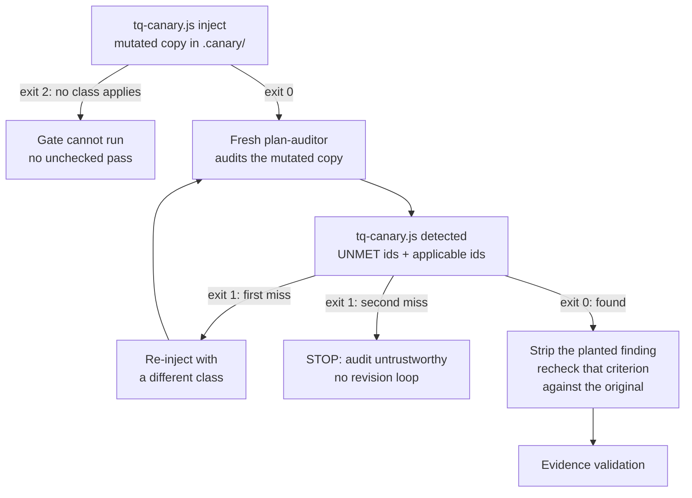
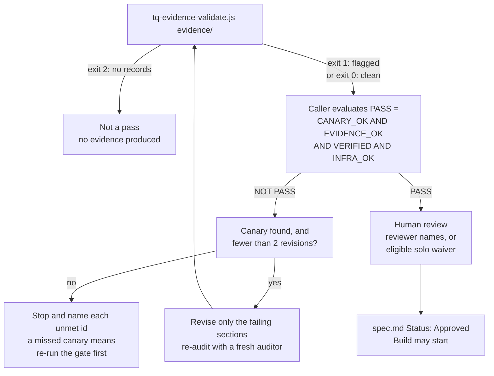

# The design gate

A design can sound complete and still omit rollback, ownership, or proof that a dependency exists. Toque sends it to a separate reviewer before Build.

The gate is the head chef at the pass: incomplete work goes back. It does not turn a passing design into permission to release.

<p align="center">
  
</p>

The canary, evidence validator, and PASS expression are Toque's design choices, not requirements attributed to Anthropic. See the [playbook relationship](../METHODOLOGY.md#relationship-to-the-ai-native-sdlc-playbook) for that distinction.

## What goes in and what comes out

Stage 2 of `/toque:plan` audits `spec.md` using a fresh `plan-auditor` instance. The author does not grade its own draft, and the judge is instructed not to use previous audit results.

The plan folder retains `audit.md` and per-criterion JSON records in `evidence/`. Verdicts remain exactly:

| Verdict | Meaning |
| --- | --- |
| `MET` | The criterion is judged satisfied; supporting evidence must survive validation. |
| `UNMET` | The criterion is not satisfied, or its passing evidence failed validation. |
| `N_A` | The criterion is judged not applicable. |

Kitchen wording in help or summaries is commentary, never an alternative status.

## 1. Check whether the auditor notices a known defect

The canary tool creates a modified spec in `.canary/`. It plants one applicable defect: for example, removing rollback detail or ownership. The original design is not the scratch copy.

The canary runs before the auditor and decides whether the audit can be trusted at all.



The five classes are `rollback-strip`, `owner-strip`, `assumption-inject`, `criteria-strip`, and `test-claim-inject`. If none applies, the tool exits 2 and reports the attempted classes; it does not pass an unchecked audit.

The auditor is not told which defect was planted. Detection requires an `UNMET` verdict for the criterion that defect violates, checked by the `detected` subcommand against the full applicable set; an audit that returns every applicable criterion `UNMET` is reported as a miss, not a detection. A first miss earns one retry with a different class. A second miss stops the gate; it does not trigger design revisions based on an audit that failed this check.

After detection, the planted finding is removed and the affected criterion is rechecked against the original spec. Canary scratch is not committed.

**What this establishes:** the auditor caught that planted defect on that run. It does not establish general accuracy or resistance to a deliberately evasive judge.

## 2. Check the evidence behind passing verdicts

`tq-evidence-validate.js` re-reads citations supporting `MET` records. It checks:

- The evidence record and verdict are valid.
- The cited file stays inside the audited root, including after resolving symlinks.
- Its required SHA-256 matches the file with LF-normalized line endings.
- The cited line range exists.
- The nonempty quote exactly matches those lines.

Invalid passing evidence is demoted to `UNMET`. The validator never promotes a verdict. Existing `UNMET` and `N_A` records do not receive the same citation-validation pass.

For executable criteria, a recorded command or `exit_code` is not trusted proof. The validator does not run it. It requires a surviving artifact citation and ignores the claimed exit code.

The [guide lists every evidence flag](../plugins/toque/GUIDE.md#evidence-flags).

## 3. Evaluate all four conditions

```text
PASS = CANARY_OK AND EVIDENCE_OK AND VERIFIED AND INFRA_OK
```

| Term | Required result |
| --- | --- |
| `CANARY_OK` | The planted defect was detected as required. |
| `EVIDENCE_OK` | Evidence validation exited 0: no failing validation flags. |
| `VERIFIED` | Every applicable criterion is `MET` or `N_A` after validation. |
| `INFRA_OK` | `infra_gaps == 0`. |

Validator exit codes feed one term of the expression; the caller evaluates the rest and decides what happens next.



Exit 2 means there was nothing to validate, the most serious result. Exit 1 means at least one record was flagged, so `EVIDENCE_OK` is false. Exit 0 means no demoting flag; an advisory about an ignored exit code can coexist with it, and so can an existing `UNMET` verdict. **Validator exit 0 alone is not a design-gate pass.**

There is no weighted score, partial credit, or “good enough overall.” One unresolved required criterion keeps the gate closed.

A separate holistic review looks for gaps outside the current criteria. Its unmapped findings become proposed rules in `docs/planning-techniques/lint-candidates.md`; they do not secretly add a new gating score.

## If the gate refuses the design

For ordinary failures, the caller sends the author the unmet criterion, defect, and location, revises only the failing sections, and launches a fresh judge that never sees the previous verdict, for at most two iterations. Remaining failures are named for manual resolution. A canary missed twice requires a new trustworthy audit, not revisions based on its findings.

## Human review and the solo waiver

An automated pass is followed by human review. Reviewers check the design and whether the cited evidence actually supports the verdicts.

Solo mode can offer a waiver only when all three conditions hold:

```text
infra_gaps == 0
canary_found == true
evidence_demotions == 0
```

Team/leadership plans require review unless solo mode is explicitly selected. The waiver needs a name and reason in `status.json`, a visible note in `audit.md`, and a note in the later handoff. The spec must be marked `Status: Approved`, with the reviewer or waiver holder named in its Author line.

The waiver skips a human check of meaning and relevance. It does **not** waive an automated failure, implementation-plan approval, manual testing, or production authorization.

## What this does not prove

> **A real citation can still be irrelevant.** A quote of a closing brace can pass byte-level checks. That does not make it evidence for a rollout strategy.

The auditor can access criterion files and the canary defect table. Isolation is an instruction, not a capability boundary. The canary is a check against an inattentive audit, not a guarantee against an adversarial one.

Evidence validation establishes citation integrity, not semantic truth, requirement completeness, or successful execution of tests. This release does not calibrate judge correctness against a known-good/known-bad plan set.

Toque's workflow rules are also not operating-system or deployment permissions. Use separate controls for production access.

The quick-plan and quick-audit entrypoints run this same gate, from the same `<design_gate>` block of the Stage 2 file, and write the same `audit.md` and `evidence/` record beside the document they audit. What they lack is what surrounds the gate in `/toque:plan`: accepted intent, scope lock, human review, and the build that follows.

[Stage workflow](the-plan-workflow.md) · [Evidence files and resume](plan-workspace.md) · [Formal methodology](../METHODOLOGY.md)
