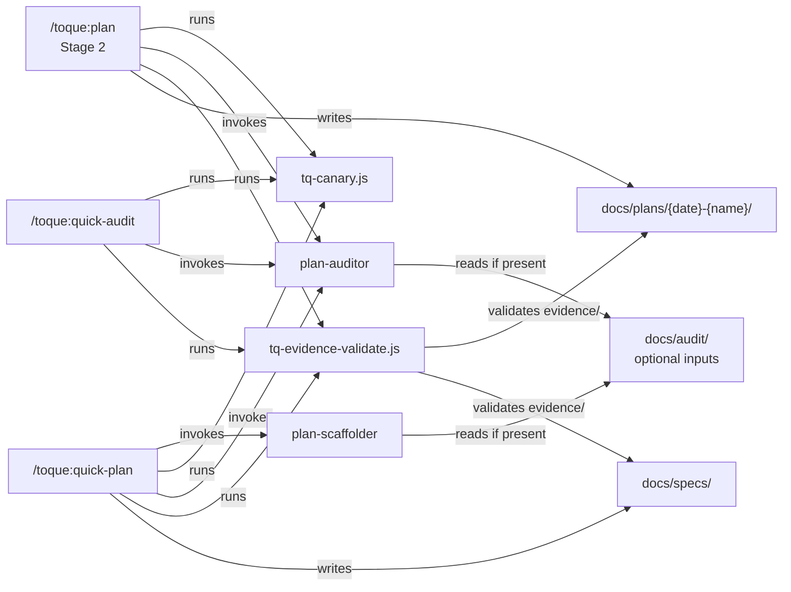

# Toque Knowledge Guide v11.0.1

**6 Commands** · **5 Skills** · **2 Agents** · **7 Document Templates** · **3 Plan-Context Hooks** · **2 Gate Tools** · **Requires Node.js 18+**

The operator's reference for a busy software kitchen: choose the right job, keep the records connected, and know which decisions are yours.

New here? Start with the [README](https://github.com/krwhynot/toque/blob/main/README.md) or [first workflow](https://github.com/krwhynot/toque/blob/main/documentation/quickstart.md). This guide covers the complete plugin surface without repeating the stage manual.

<p align="center">
  
</p>

## Commands at a glance

Nine user-facing entrypoints. `plan`, `troubleshoot`, and `documentation` are skills; the other six are command files.

| Entrypoint | Job | Main result |
| --- | --- | --- |
| `/toque:help` | Show capabilities and usage | Conversation output |
| `/toque:plan {name}` | Start or resume full delivery workflow | Plan workspace |
| `/toque:quick-plan {objective}` | Draft a smaller plan and run it through the design gate | `docs/specs/{name}.md` plus its gate record in `docs/specs/{name}/` |
| `/toque:quick-audit {path}` | Run the design gate against an existing plan | Gate result; `audit.md`, `evidence/`, `gate.json` in the plan folder or a gate folder beside the file |
| `/toque:plan-status [name]` | Inspect progress | Status summary |
| `/toque:quick-cleanup {folder} {topic}` | Extract usable source references | Plan intake files |
| `/toque:plan-export {name}` | Package a plan for another developer | Export zip |
| `/toque:troubleshoot {problem}` | Investigate a bug or incident | Troubleshooting record |
| `/toque:documentation {type} {topic}` | Generate a project document | One of seven document types |

Square brackets indicate optional arguments; braces indicate values to supply.

### Plan

```text
/toque:plan scheduled-reports
/toque:plan intent scheduled-reports
/toque:plan scheduled-reports from docs/vendor-specs/
```

The `intent` form stops after Stage 1, even if the owner accepts. The normal form creates or resumes `docs/plans/YYYY-MM-DD-{name}/`. The `from` form provides source documents for intake.

This is not a draft-only command: after approval it can implement and test. It must not perform production release.

### Quick plan

```text
/toque:quick-plan Extract pricing logic from Order.vb
```

Clarifies a vague request as needed, uses the scaffolder, writes a spec to `docs/specs/{name}.md`, then runs the design gate with up to two revisions. The gate record (`audit.md`, `evidence/`) is written beside the spec in `docs/specs/{name}/`; commit it with the spec. `.canary/` in that folder is scratch.

`--plan {name}` links output to an existing plan and adds rows to its manifest; it does not create a full plan workspace on its own, and it does not write into the plan folder's own gate record.

The gate is the same one Stage 2 runs, executed from the same `<design_gate>` block in the stage file: canary, evidence validation, lint registry, gap outputs, and the gate expression. A `PASS` here is a design-gate pass for that document. It is not a human review, and it does not authorize a build or a release.

### Quick audit

```text
/toque:quick-audit docs/specs/scheduled-reports.md
/toque:quick-audit docs/plans/YYYY-MM-DD-scheduled-reports/spec.md --plan scheduled-reports
```

Runs the design gate against one file and reports criterion verdicts, canary result, evidence validation, and findings. A named or detected plan receives `audit.md` and index/state updates in its own folder. Any other file gets a gate folder beside it, named after the file without its extension (`docs/specs/pricing.md` is audited into `docs/specs/pricing/`); there is no conversation-only result and no fallback report in `docs/audit/`. A pasted plan is written to `docs/specs/` first.

There is no generator to revise the document, so `NOT PASS` is reported with the unmet criteria named. A pass is a design-gate pass for that file, not human review or production authorization.

### Status

```text
/toque:plan-status
/toque:plan-status scheduled-reports
```

Shows plans or a selected plan's progress, artifacts, and next-step context. Resume work with `/toque:plan {name}`. [State and freshness rules](https://github.com/krwhynot/toque/blob/main/documentation/plan-workspace.md) explain what the summary means.

### Source cleanup

```text
/toque:quick-cleanup docs/vendor-manuals payment-api
/toque:quick-cleanup docs/vendor-manuals payment-api --plan payment-api
```

Clarifies what the material is for, then extracts Markdown and structured references into `research/intake/`. It can create a plan homebase with `intent.md` and schema-2 state, or link to an existing plan.

Cleanup is reference preparation, not an implementation plan. It may be the whole task.

### Export

```text
/toque:plan-export scheduled-reports
```

Stages the plan and referenced documents, scans for secrets to redact, and creates `{plan-name}-export.zip`. The package uses `plans/{name}/`, not the source workspace's `docs/plans/` layout.

The receiving developer unpacks it into a compatible project and uses the included `CLAUDE.md` instructions with vanilla Claude Code. Compatibility checks and redaction are review aids, not guarantees. Inspect the archive and redaction log before sharing; do not overwrite an existing recipient folder without checking it.

### Troubleshooting

```text
/toque:troubleshoot Reports are being sent twice
/toque:troubleshoot --plan scheduled-reports Reports are being sent twice
```

The four investigation phases are Root Cause, Pattern Analysis, Hypothesis, and Fix. The workflow checks the knowledge base first and verifies the resolution before recording it. For an incident, use `--severity SEV1` or the appropriate severity. SEV1/SEV2 handling adds containment approval, status updates, and a blameless `-postmortem.md` beside the log.

Logs go into the linked plan's `troubleshooting/` directory or `docs/troubleshooting/` when standalone. Reusable findings go to `docs/troubleshooting/knowledge-base.md`. Production-impacting actions retain their approval boundary.

### Documentation

```text
/toque:documentation adr Report delivery queue
/toque:documentation runbook Scheduled reports --plan scheduled-reports
```

Supported subcommands: `adr`, `brd`, `prd`, `readme`, `runbook`, `release-notes`, `spec`.

Plan-linked documents use their standard project locations and are linked from the manifest. A plan-linked runbook is the exception: it belongs inside the plan folder.

## The six stages

The lifecycle reference is [Anthropic's AI-Native SDLC playbook](https://claude.com/blog/the-ai-native-sdlc-playbook). The [methodology comparison](https://github.com/krwhynot/toque/blob/main/METHODOLOGY.md#relationship-to-the-ai-native-sdlc-playbook) separates that wider model from Toque's shipped capabilities.

| Stage | Primary artifacts | Decision |
| --- | --- | --- |
| Plan | `intent.md`, research | Named owner accepts. |
| Design | `spec.md`, `audit.md`, `evidence/` | Scope lock; automated gate; review or eligible waiver; approved spec. |
| Build | `plan.md`, code, `impact-review.md` | Approve plan before implementation; confirm impact afterward. |
| Test | `test-plan.md`, results | Automated pass and human-confirmed manual checks. |
| Deploy | `review.md`, release checklist | Named human authorizes, performs, then confirms production release; authorization and release are recorded separately. |
| Maintain | Incident records; new draft intent when warranted | Steady state, not a completion gate. |

[Stage-by-stage contracts](https://github.com/krwhynot/toque/blob/main/documentation/the-plan-workflow.md) cover assumptions, parallel work, Change Records, and incident recurrence.

> **Chef's rule:** the agent may prepare the release. A human decides whether it leaves the kitchen—and performs the release.

Toque has no blocking command hooks. These workflow instructions do not replace Claude Code permission rules, CI controls, or production access restrictions.

## The design gate

```text
PASS = CANARY_OK AND EVIDENCE_OK AND VERIFIED AND INFRA_OK
```

A fresh judge returns `MET`, `UNMET`, or `N_A` per criterion. Stage 2 checks detection of a planted defect and validates citations supporting passing verdicts. All applicable criteria must survive, with no infrastructure gaps. There is no weighted score.

“Back to the kitchen” may explain an `UNMET` result, but it never replaces that canonical value.

Read the [design-gate reference](https://github.com/krwhynot/toque/blob/main/documentation/the-design-gate.md) for retry rules and the conditional solo-review waiver. Keep its limits in view:

- A canary establishes detection of one planted defect, not general judge accuracy.
- Evidence validation checks citation integrity, not relevance or truth.
- The judge's isolation is instructional, not an access boundary.
- Neither an automated pass nor a review waiver authorizes production.

### Evidence flags

This table is the flag lookup for `tq-evidence-validate.js`.

| Flag | Meaning / next check |
| --- | --- |
| `EVIDENCE-INVALID` | Quote does not match the cited lines. Re-read the source. |
| `EVIDENCE-MISSING` | A `MET` record has no evidence. Supply real citations. |
| `EVIDENCE-STALE` | File hash changed. Recheck the claim against current content. |
| `EVIDENCE-UNPINNED` | Required SHA-256 is missing. |
| `EVIDENCE-ARTIFACT-MISSING` | Cited file does not exist. |
| `EVIDENCE-PATH-ESCAPE` | Citation is absolute or escapes the audited root, including through a symlink. |
| `EVIDENCE-RANGE-INVALID` | Cited line range is invalid or outside the file. |
| `EVIDENCE-QUOTE-EMPTY` | Quote is empty or whitespace-only. |
| `EVIDENCE-UNSUPPORTED` | Executable criterion has no surviving verified citation. |
| `EVIDENCE-VERDICT-INVALID` | Verdict is not `MET`, `UNMET`, or `N_A`, including malformed record shapes. |
| `EVIDENCE-UNPARSEABLE` | Record file is not valid JSON. |
| `EVIDENCE-EXITCODE-IGNORED` | Advisory: the supplied exit code carries no evidentiary weight. |

A failing flag can demote `MET` to `UNMET`; validation never promotes a verdict. The last flag is advisory and does not itself fail validation. The script does not execute commands in evidence records.

## How the pieces connect

Three entrypoints call the agents and gate tools; everything else you type only reads and writes files, and the hooks are called by Claude Code, not by you.



The plan skill drives the six stages and, in Stage 2, runs the design gate: the canary tool, the plan-auditor, and the evidence validator against the plan folder's `evidence/` directory. Quick-plan invokes the scaffolder, writes a spec under `docs/specs/`, then runs that same gate against it with the gate record in `docs/specs/{name}/`; quick-audit runs the same gate against one file, into the plan folder or a gate folder beside the file. All three execute the `<design_gate>` block of the Stage 2 file. Both agents may read optional analysis under `docs/audit/` and both load the `self-audit-knowledge` skill. The other entrypoints call no agent: `/toque:troubleshoot` writes logs, `/toque:documentation` writes documents and links them from a plan's manifest, and `plan-status`, `plan-export`, `quick-cleanup`, and `help` read or package files. The three hooks are listed in [The 3 hooks](#the-3-hooks): Claude Code starts them on its own events, two read the newest plan's `status.json`, and the SubagentStop handler appends a log line only when a plan's `troubleshooting/` folder already exists.

## The 2 agents

| Agent | Role |
| --- | --- |
| `plan-scaffolder` | Builds a structured technical draft using parallel analysis. |
| `plan-auditor` | Independently challenges the draft and reports criteria, findings, and evidence. |

Both load `self-audit-knowledge` to distinguish verified claims, code-reading evidence, and inference.

## The 5 skills

| Skill | Responsibility |
| --- | --- |
| `plan` | Routes the six-stage workflow; loads stage instructions and templates as needed. |
| `troubleshoot` | Routes investigation, incident handling, logs, and knowledge-base updates. |
| `documentation` | Selects document templates and maintains document-chain links. |
| `self-audit-knowledge` | Claim verification tiers, uncertainty flags, and cascade-risk classification. |
| `mcp-research` | Selects available external research tools and records missing research capability. |

The first three expose the user-facing workflows above. The other two support them.

## The 7 document templates

| Subcommand | Document | Standard location |
| --- | --- | --- |
| `adr` | Architecture Decision Record | `docs/adr/` |
| `brd` | Business Requirements Document | `docs/brd/` |
| `prd` | Product Requirements Document | `docs/prd/{domain}/` |
| `readme` | Project README | Project root |
| `runbook` | Operational runbook | `docs/runbooks/`, or `runbook.md` in a linked plan |
| `release-notes` | Release notes / changelog | `docs/` or project root |
| `spec` | Technical specification | `docs/specs/` |

Templates can read optional analysis under `docs/audit/`. They do not write back to those external inputs. [Interop](https://github.com/krwhynot/toque/blob/main/interop.md) is the authoritative path/consumer list.

## The 3 hooks

All three are informational Node handlers. They fail open and return exit 0 when run; they do not enforce design or deployment gates.

| Event | Script | Behavior |
| --- | --- | --- |
| SessionStart | `tq-session-start.js` | Reports the newest plan's saved phase and status, including on resume. |
| SubagentStop | `tq-subagent-stop.js` | Appends a completion log only when the plan's troubleshooting directory already exists. |
| PreCompact | `tq-pre-compact.js` | Emits active-plan context before compaction. |

SessionStart also provides context after compact-resume. The removed audit-report staleness warning is not part of these hooks.

Without Node, the handlers cannot start; fail-open handling inside a script does not fix a missing runtime.

## The scripts

Five Node files live in `scripts/`: the three hook handlers and two explicit gate tools ([how they are called](#how-the-pieces-connect)).

From `plugins/toque/` in a development checkout:

```bash
node scripts/tq-canary.js inject <spec-path> <out-dir> [seed]
node scripts/tq-canary.js detected <canary.json> <unmet-csv> <applicable-csv>
node scripts/tq-evidence-validate.js <evidence-dir> [root-dir]
```

Injection prepares scratch; it does not establish detection. The `detected` command checks the audit's unmet criteria against the planted defect. Supply the complete applicable-criteria list so blanket rejection can be rejected. The full sequence is defined once, in the `<design_gate>` block of the Stage 2 file, and run from there by `/toque:plan`, `/toque:quick-plan`, and `/toque:quick-audit`.

The evidence validator exits 0 with no failing validation flags, 1 for validation failures, and 2 for missing/unusable input such as an empty evidence directory. An existing `UNMET` can coexist with exit 0: the caller must still evaluate `VERIFIED`.

Treat evidence records as untrusted data. The validator uses hashes, ranges, quote checks, and root containment rather than trusting claimed command outcomes.

## Where files land

The [workspace reference](https://github.com/krwhynot/toque/blob/main/documentation/plan-workspace.md) owns the full plan tree and schema migration.

| Output outside the main artifact chain | Location |
| --- | --- |
| Quick plans / standalone specs | `docs/specs/` |
| Standalone troubleshooting logs | `docs/troubleshooting/YYYY-MM-DD-{slug}.md` |
| Shared troubleshooting knowledge base | `docs/troubleshooting/knowledge-base.md` |
| Proposed lint rules | `docs/planning-techniques/lint-candidates.md` |
| Export archive | `{plan-name}-export.zip` at project root |

Planning records and evidence are intended for version control. Canary scratch and export archives are not.

## How to install

```bash
claude plugin marketplace add krwhynot/toque
claude plugin install toque@toque-marketplace --scope user
```

Check `node --version` separately, then start Claude Code and run `/toque:help`.

[Installation reference](https://github.com/krwhynot/toque/blob/main/documentation/install.md) covers scopes, prerequisites, rename upgrades, and troubleshooting.

## How to update

Refresh the catalog in a session with `/plugin marketplace update toque-marketplace`. Update the installed copy in a terminal:

```bash
claude plugin update toque@toque-marketplace --scope user
```

Use your installed scope. Run `/reload-plugins` or restart, then inspect the installed version in `/plugin`. A repository pull is not an installed-plugin update.

For development against the working tree, launch `claude --plugin-dir ./plugins/toque` from the repository root. Do not confuse that local session with a versioned marketplace install.

## Further reference

[Methodology](https://github.com/krwhynot/toque/blob/main/METHODOLOGY.md) explains the design rationale and retains historical material. [Interop](https://github.com/krwhynot/toque/blob/main/interop.md) lists optional read-only external inputs. [When to use Toque](https://github.com/krwhynot/toque/blob/main/documentation/when-to-use.md) helps choose a smaller workflow when the full one is unnecessary.
